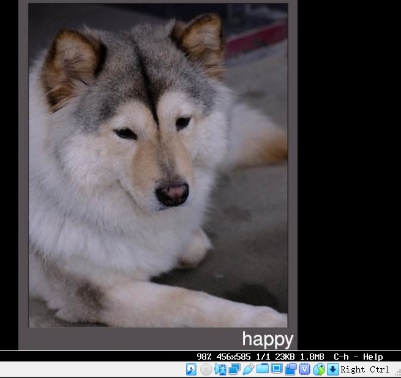
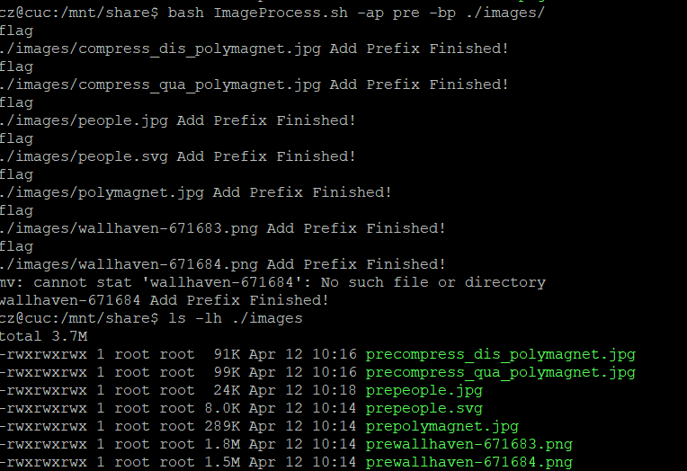
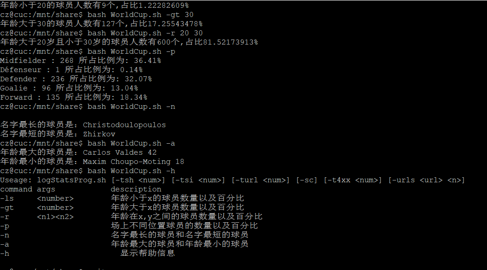
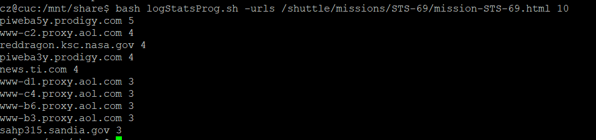
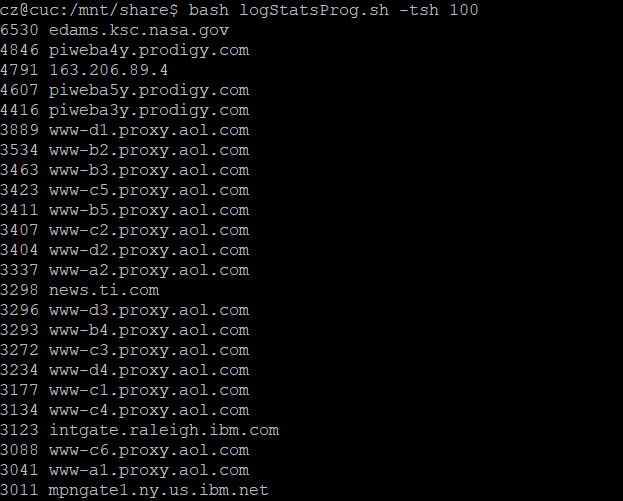

## shell实验报告

#### 实验环境

- ubuntu18.04

#### 实验工具

- shell
- ImageMagick 图片处理工具
- awk

#### 任务一：用bash编写一个图片批处理脚本，实现以下功能

- 支持命令行参数方式使用不同功能
- 支持对指定目录下所有支持格式的图片文件进行批处理
- 支持以下常见图片批处理功能的单独使用或组合使用
  - 支持对jpeg格式图片进行图片质量压缩
  - 支持对jpeg/png/svg格式图片在保持原始宽高比的前提下压缩分辨率
  - 支持对图片批量添加自定义文本水印
  - 支持批量重命名（统一添加文件名前缀或后缀，不影响原始文件扩展名）
  - 支持将png/svg图片统一转换为jpg格式图片

##### 帮助信息

```
Usage:

 ImageProcess.sh [-f filename][-cq percent][-cd percent][-cf][-am text][-as suffix][-ap prefix][-bp directory][-h]

  command       arguments       description
  -f,           <filename>      The filename
  -cq,          <percent>       Compress image quality
  -cd,          <percent>       Compresse image distinguishability
  -cf,                          Change image format to jpg
  -am,          <text>          Add text watermark
  -as,          <text>          Add suffixname
  -ap,          <text>          Add prefixname
  -bp,          <directory>     Batch processing of image
  -h,                           help

```

##### 实例说明

```shell
# 对jpeg格式图片进行图片质量压缩
bash ImageProcess.sh -f ./images/test.jpg -cq 50

# 对jpeg/png/svg格式图片在保持原始宽高比的前提下压缩分辨率
bash ImageProcess.sh -f ./images/test.jpg -cd 80

# 对图片添加自定义文本水印
bash ImageProcess.sh -f ./images/test.jpg -am czhappy

# 对图片添加前后缀
bash ImageProcess.sh -f ./images/test.jpg -ap pre
bash ImageProcess.sh -f ./images/test.jpg -as suf

#png/svg图片统一转换为jpg格式图片
bash ImageProcess.sh -f ./images/test.png -cf

#批量处理 添加水印
bash ImageProcess.sh -am HELLO -bp ./images 
```
##### 实验结果




#### 任务二：用bash编写一个文本批处理脚本，对以下附件分别进行批量处理完成相应的数据统计任务：

- [2014世界杯运动员数据](http://sec.cuc.edu.cn/huangwei/course/LinuxSysAdmin/exp/chap0x04/worldcupplayerinfo.tsv)

  - 统计不同年龄区间范围（20岁以下、[20-30]、30岁以上）的球员**数量**、**百分比**
  - 统计不同场上位置的球员**数量**、**百分比**
  - 名字最长的球员是谁？名字最短的球员是谁？
  - 年龄最大的球员是谁？年龄最小的球员是谁？

  ##### 实验结果

  

#### 任务三：用bash编写一个文本批处理脚本，对以下附件分别进行批量处理完成相应的数据统计任务：

- [Web服务器访问日志](http://sec.cuc.edu.cn/huangwei/course/LinuxSysAdmin/exp/chap0x04/web_log.tsv.7z)

  - 统计访问来源主机TOP 100和分别对应出现的总次数
  - 统计访问来源主机TOP 100 IP和分别对应出现的总次数
  - 统计最频繁被访问的URL TOP 100
  - 统计不同响应状态码的出现次数和对应百分比
  - 分别统计不同4XX状态码对应的TOP 10 URL和对应出现的总次数
  - 给定URL输出TOP 100访问来源主机

  ##### 帮助信息

```
cz@cuc:/mnt/share/script$ bash logStatsProg.sh
Useage: logStatsProg.sh [-tsh <num>] [-tsi <num>] [-turl <num>] [-sc] [-t4xx <num>] [-urls <url> <n>]
command args            description
-tsh    <number>        统计来源主机top x 和分别对应的总次数
-tsi    <number>        统计来源主机top x IP 和分别对应的总次数
-turl   <number>        统计最频繁被访问的URL top x
-sc                     统计不同相应状态码的出现次数和对应百分比
-t4xx   <number>        统计不同4XX状态码对应的top x URL和对应出现总次数
-urls   <url><n>        给定URL输出top x访问来源主机
-h                      显示帮助信息
```
##### 实例说明

```shell
# 给定URL查询输出top10 访问来源主机
bash logStatsProg.sh -urls /shuttle/missions/STS-69/mission-STS-69.html
#统计来源主机top100和分别对应总次数
bash logStatsProg.sh -tsh 100
```
 ##### 实验结果

  
  

#### 参考资料
- [Linux-2017-FitBC](<https://github.com/FitzBC/linux/tree/0636a22f94a388f3869d799cdc7c22cd693ed214/2017-1/FitzBC/%E5%AE%9E%E9%AA%8C4>)
- [shell 参考教程](https://www.w3cschool.cn/linux/linux-shell.html)
- [ImageMagic convert](https://www.imagemagick.org/script/convert.php)
- [awk](https://coolshell.cn/articles/9070.html)
- [sed](<http://man.linuxde.net/sed>)
- [travis ci 阮一峰](http://www.ruanyifeng.com/blog/2017/12/travis_ci_tutorial.html)