# 第五章：Web服务器实验

---

## 实验环境
* ubuntu 18.04
* [Nginx](http://nginx.org/)
* [VeryNginx](https://github.com/alexazhou/VeryNginx) port 80
* [Wordpress](https://wordpress.org/)
* [Damn Vulnerable Web Application (DVWA)](http://www.dvwa.co.uk/)

# 实验检查点

---

## 基本要求

* 在一台主机（虚拟机）上同时配置[Nginx](http://nginx.org/)和[VeryNginx](https://github.com/alexazhou/VeryNginx)
    
    * PHP-FPM进程的反向代理配置在nginx服务器上，VeryNginx服务器不直接配置Web站点服务
    * [安装VeryNginx](https://github.com/alexazhou/VeryNginx/blob/master/readme_zh.md)
      * 依赖库

        ```bash
        sudo apt install openssl1.0
        sudo apt install libssl1.0-dev
        sudo apt install lua-rex-pcre
        sudo apt install libssl build_essential
        #注意安装1.0.2版本的OpenSSL和libssl 否则报错
        ```
      *  结果

        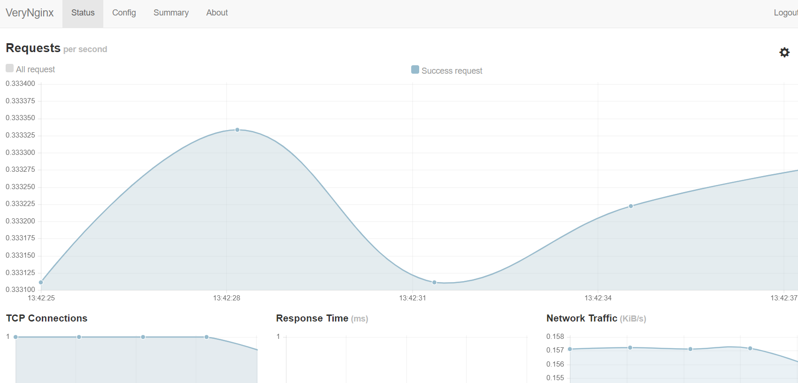
        
    * [安装nginx](https://www.digitalocean.com/community/tutorials/how-to-install-linux-nginx-mysql-php-lemp-stack-ubuntu-18-04)
    
    * 结果

        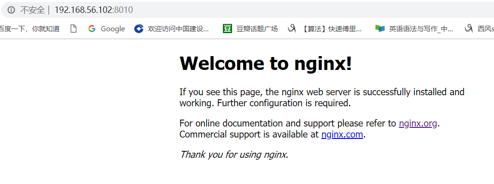

    * 关于配置文件
      * nginx的配置文件在/etc/nginx 其中需要更改/etc/nginx/sites-available相应站点的server模块，添加fpm的语句， 并需要和/etc/nginx/sites-enabled生成符号链接
        ```bash
        location ~ \.php$ {
                include snippets/fastcgi-php.conf;
                fastcgi_pass unix:/var/run/php/php7.2-fpm.sock;
        }

        location ~ /\.ht {
                deny all;
        }
        ```
      * verynginx的配置文件在其内部的conf文件夹下的nginx.conf
    
* 使用[Wordpress](https://wordpress.org/)搭建的站点对外提供访问的地址为： https://wp.sec.cuc.edu.cn 和 http://wp.sec.cuc.edu.cn
  * [wordpress安装](https://www.digitalocean.com/community/tutorials/how-to-install-wordpress-with-lemp-on-ubuntu-18-04)
  * 结果

    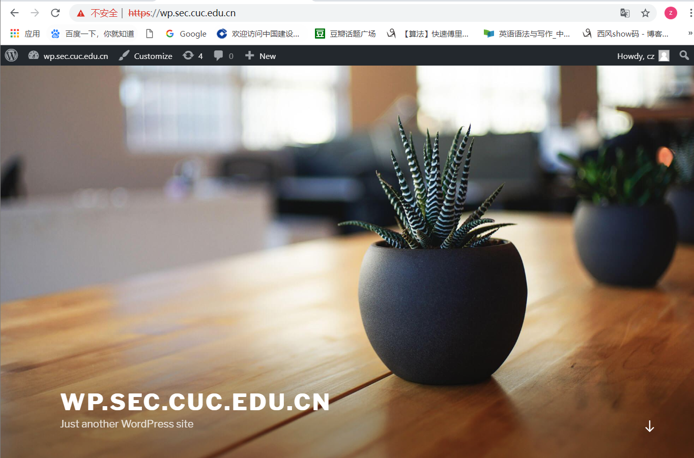


  * [生成自签发证书](https://www.digitalocean.com/community/tutorials/how-to-create-a-self-signed-ssl-certificate-for-nginx-in-ubuntu-18-04)

    ```bash
    sudo openssl req -x509 -nodes -days 365 -newkey rsa:2048 -keyout /etc/ssl/private/nginx-selfsigned.key -out /etc/ssl/certs/nginx-selfsigned.crt

    # 配置nginx的wordpress站点的的配置文件
    server{
        listen 443 ssl;
        listen [::]:443 ssl;
        include snippets/self-signed.conf;
        include snippets/ssl-params.conf;

        server_name wp.sec.cuc.edu.cn;
        root /var/www/wordpress;
        index index.php index.html index.htm index.nginx-debian.html;

        location = /favicon.ico { log_not_found off; access_log off; }
        location = /robots.txt { log_not_found off; access_log off; allow all; }
        location ~* \.(css|gif|ico|jpeg|jpg|js|png)$ {
                expires max;
                log_not_found off;
        }


        location / {
              #  try_files $uri $uri/ =404;
                 try_files $uri $uri/ /index.php$is_args$args;
        }
        # php-fpm
        location ~ \.php$ {
                include snippets/fastcgi-php.conf;
                fastcgi_pass unix:/var/run/php/php7.2-fpm.sock;
        }

        location ~ /\.ht {
                deny all;
        }
    }
    #再加一个重定向
   
    server {
    listen 8050;
    listen [::]:8050;

    server_name wp.sec.cuc.edu.cn;

    return 301 https://$server_name$request_uri;
    }

    ```
  * 结果

    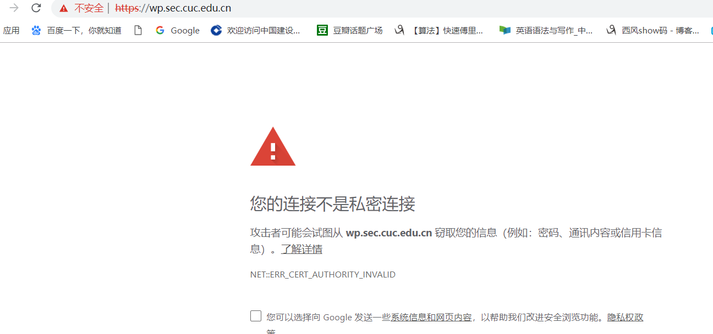
    ```bash
    #修改302为301
     return 301 https://$server_name$request_uri;
     #仍然是这样
    ```
* VeryNginx作为本次实验的Web App的反向代理服务器和WAF

    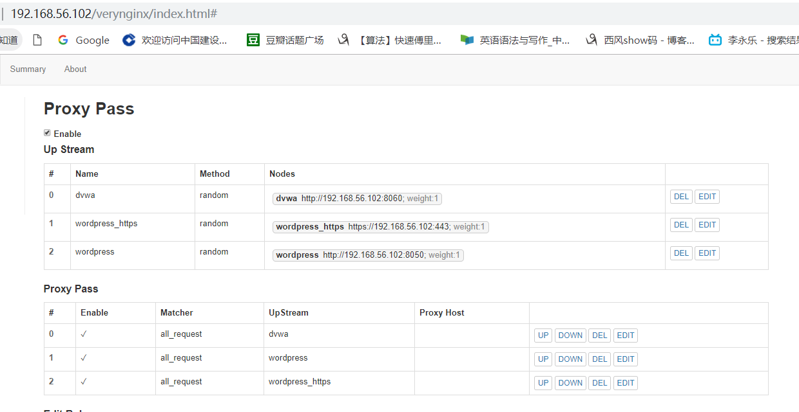

    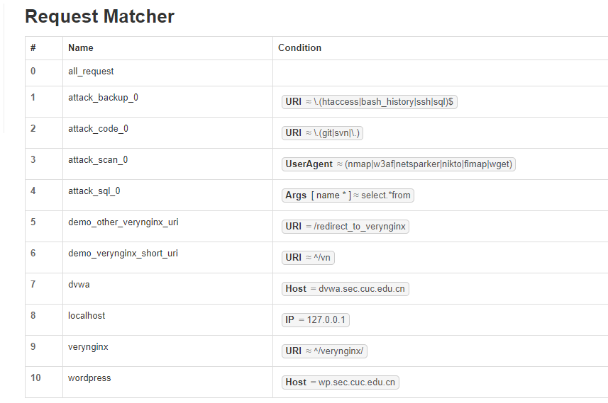


  
* 使用[Damn Vulnerable Web Application (DVWA)](http://www.dvwa.co.uk/)搭建的站点对外提供访问的地址为： http://dvwa.sec.cuc.edu.cn
  * [安装dvwa](https://kifarunix.com/how-to-setup-damn-vulnerable-web-app-lab-on-ubuntu-18-04-server/)

    ```bash
        #下载
        sudo git clone https://github.com/ethicalhack3r/DVWA /tmp/DVWA
        sudo mv /tmp/DVWA /var/www/html/dvwa
        #注意重命名config.inc.php.dist为config.inc.php，否则报错
         sudo mv /var/www/html/dvwa/config/config.inc.php.dist /var/www/html/dvwa/config/config.inc.php

        #按照教程里配置sql并修改dvwa关于数据库的配置内容，这里不再赘述

        #修改php配置
         #修改配置文件 并保存退出
        sudo vim /etc/php/7.2/fpm/php.ini
        #设置以下项目
        allow_url_include = on
        allow_url_fopen = on
    ```
  * 结果

    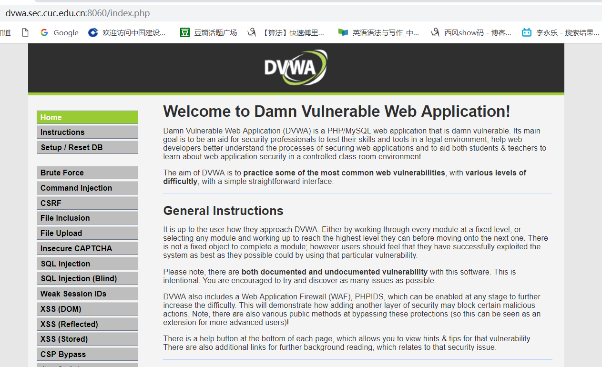

---

## 安全加固要求

* 使用IP地址方式均无法访问上述任意站点，并向访客展示自定义的**友好错误提示信息页面-1**
  * RM
    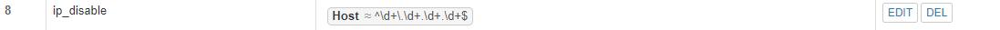

  * RE
    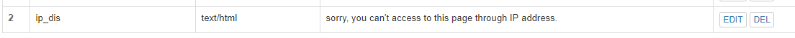

  * Filter
    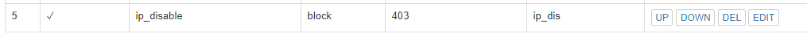

  * 结果


    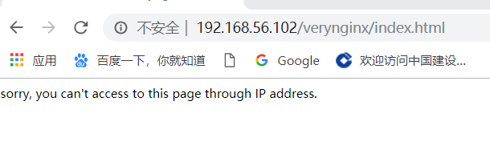


* [Damn Vulnerable Web Application (DVWA)](http://www.dvwa.co.uk/)只允许白名单上的访客来源IP，其他来源的IP访问均向访客展示自定义的**友好错误提示信息页面-2**
  * RM
  
    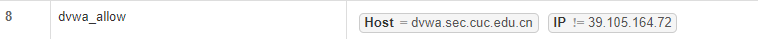

  * RE


    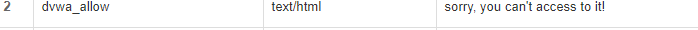


  * Filter  
    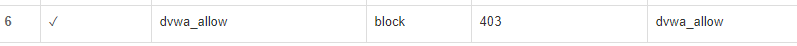

  * 结果


    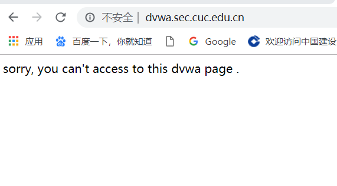


* 在不升级Wordpress版本的情况下，通过定制[VeryNginx](https://github.com/alexazhou/VeryNginx)的访问控制策略规则，**热**修复[WordPress \< 4.7.1 - Username Enumeration](https://www.exploit-db.com/exploits/41497/)
  * 添加规则

  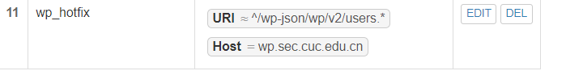

  * 效果


  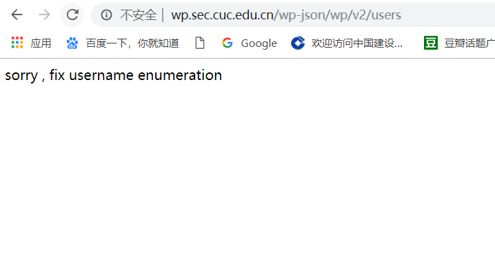


* 通过配置[VeryNginx](https://github.com/alexazhou/VeryNginx)的Filter规则实现对[Damn Vulnerable Web Application (DVWA)](http://www.dvwa.co.uk/)的SQL注入实验在低安全等级条件下进行防护


  * Filter
    
  * 前后结果
  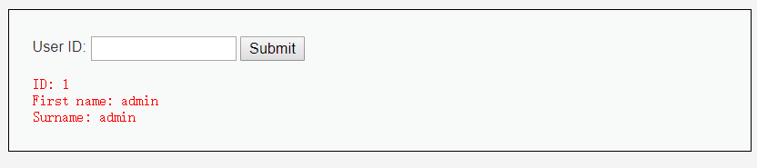
  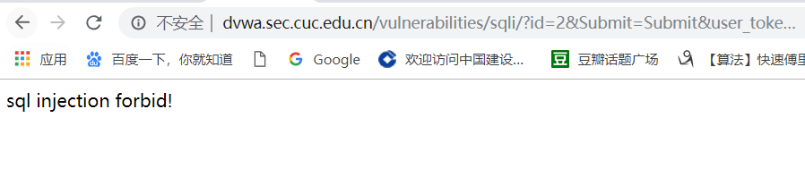


## VeryNginx配置要求

* [VeryNginx](https://github.com/alexazhou/VeryNginx)的Web管理页面仅允许白名单上的访客来源IP，其他来源的IP访问均向访客展示自定义的**友好错误提示信息页面-3**
  * Filter 过滤器 设置同之前只允许白名单IP

  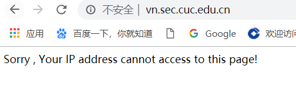

* 通过定制[VeryNginx](https://github.com/alexazhou/VeryNginx)的访问控制策略规则实现：
    * 限制DVWA站点的单IP访问速率为每秒请求数 < 50
    * 限制Wordpress站点的单IP访问速率为每秒请求数 < 20
    * 超过访问频率限制的请求直接返回自定义**错误提示信息页面-4**

      * Frequency Limit  

      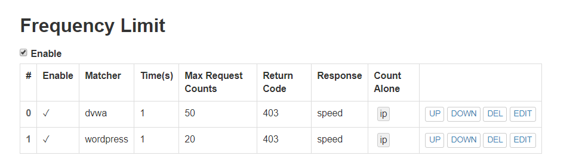

      * 测试(安装appache，使用bin目录下的ab工具，在windows宿主机中测)

      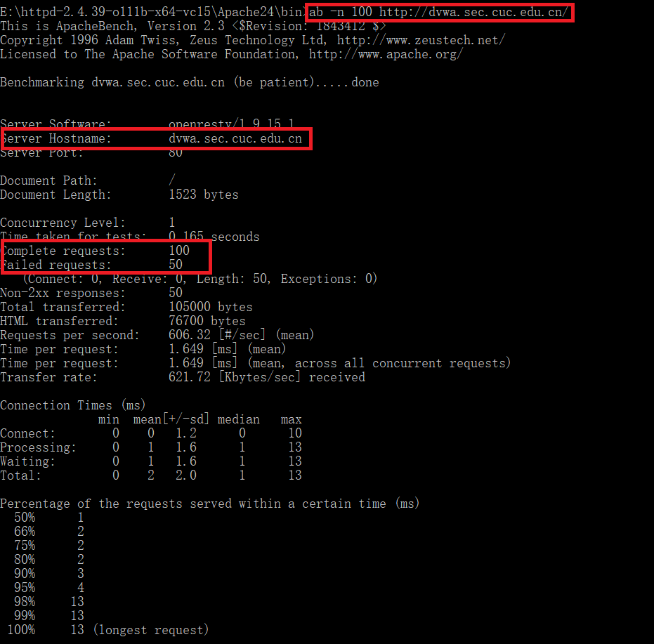
      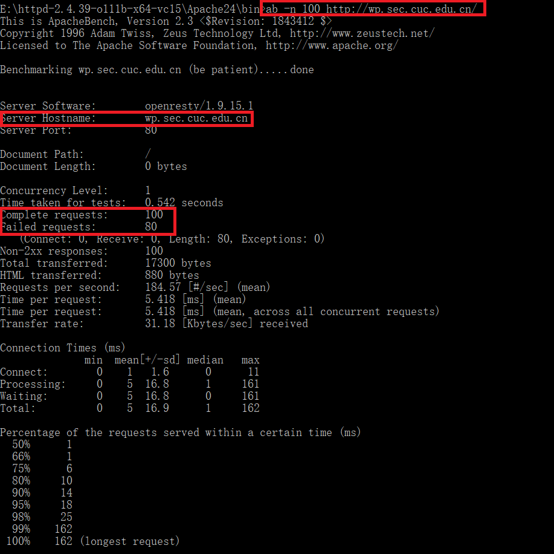


    * 禁止curl访问
      * 规则

      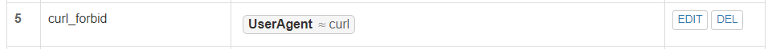

      * 效果

      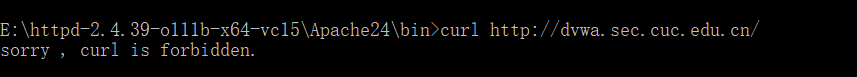

## 实验遇到的问题
- [x] 证书签发后用https访问wp.sec.cuc.edu.cn，还是会提出警告证书无效
  - 需要在本地安装此网站证书，方法是安装证书并且安装在本地计算机的“受信用的根证书颁发机构”
  - 注意，证书颁发的域名必须和wordpress配置的域名一致，否则无法匹配，所以在生成自签名密钥时应设置好
  - 重启浏览器
  
  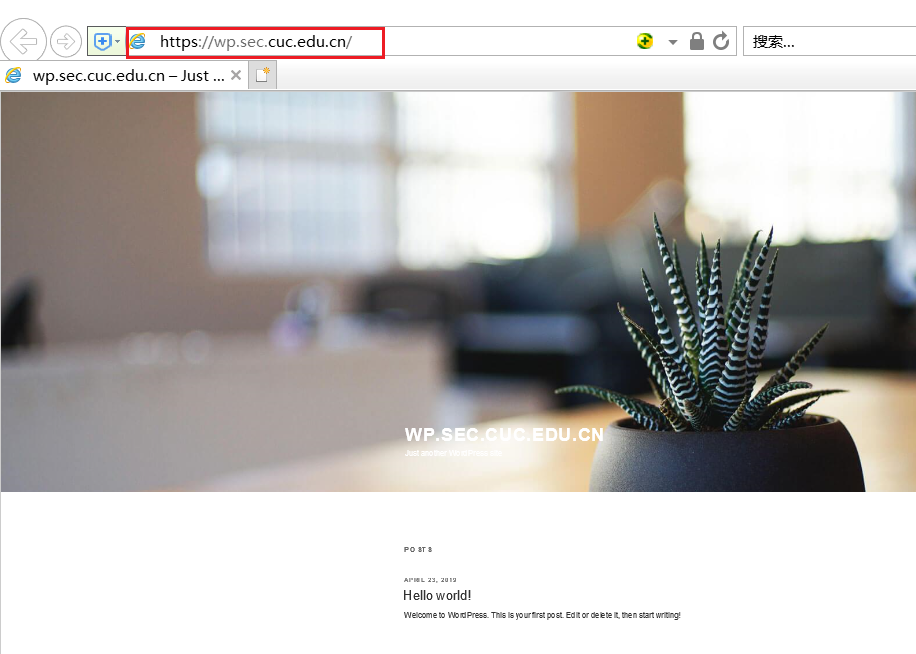
  
- [x] 禁止本机IP访问上述自己在verynginx配置页配置的主机后，无法再管理verynginx
  - 删除verynginx中的config.json文件，重启verynginx
  - 为了不必要的重新设置，备份基础配置的config.json
- [x] 实验遇到错之后往往一顿稀里糊涂的操作，失败后要想还原回原先的实验环境不容易，所以要在重要实验关键点【备份】
- [x] 安装verynginx时要使用老版本(1.0.2)的openssl和libssl，否则报错
- [x] 访问wp_sec.cuc.edu.cn时跳转到带端口号的URL，暴露了端口号
  - 在数据库wp_options中或者wordpress仪表盘中设置选项中修改,删除两项后面的 :4433
  
  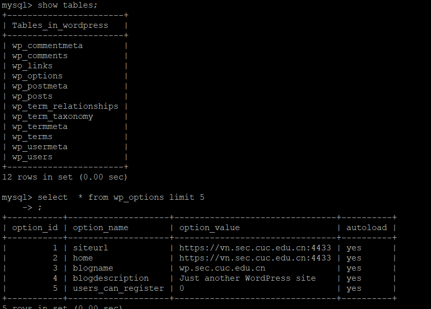 


## 参考资料
- [ 安装 LEMP](https://www.digitalocean.com/community/tutorials/how-to-install-linux-nginx-mysql-php-lemp-stack-ubuntu-18-04)
- [安装 wordpress](https://www.digitalocean.com/community/tutorials/how-to-install-wordpress-with-lemp-on-ubuntu-18-04)
- [安装 DVWA](https://kifarunix.com/how-to-setup-damn-vulnerable-web-app-lab-on-ubuntu-18-04-server/)
- [自签发证书](https://www.digitalocean.com/community/tutorials/how-to-create-a-self-signed-ssl-certificate-for-nginx-in-ubuntu-18-04)
- [正则表达式 中文版](https://zh.wikipedia.org/wiki/%E6%AD%A3%E5%88%99%E8%A1%A8%E8%BE%BE%E5%BC%8F)
  
