# 实验七 使用ansible技术重构FTP、NFS、DHCP、DNS、Samba服务器的自动安装与自动配置
## 实验环境
- ubuntu 18.04
- ansible 


## 实验要求
 - [x] DHCP
 - [x] DNS
 - [x] NFS
 - [x] PROFTPD
 - [x] Samba

## 实验步骤
- 更改新建虚拟机host only IP
  - 修改机器ID ，把其中一个数字改动一下即可

    ```bash
    sudo vi/etc/machine-id
    sudo netplan apply
    ```
- 免密登录
  - 主机A 192.168.56.116 主机B 192.168.56.113，使用主机A的ansible自动化部署各Role到主机B上
  - 在A B上各自生成秘钥，将A的公钥id_rsa.pub内容拷贝至B的authorized_keys文件中

- 安装ansible
    ```bash
        #安装依赖
        sudo apt-get ansible
    ```
- 配置/etc/ansible
  - 定义全局变量var
  - 定义host,主要写明部署目标IP
  - 定义各个Role，具体见ansible/roles文件
  - 定义deploy.yml，写明任务和部署目标
  - 编写install.sh脚本,启动自动化部署

- 工作区结构

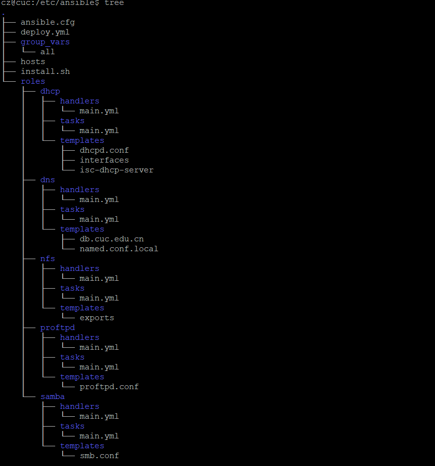

- 尝试ping目标主机
  - 报错，缺少python

    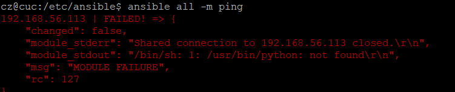


  - ansible默认/usr/bin/python，此处的python是Python2版本，ubuntu18.04自带python3 

    ```bash
    whereis python
    #在host文件定义[web]的python路径
    [web:vars]
    ansible_python_interpreter=/usr/bin/python3.6

    ```
  - 继续报错，permission deny 


    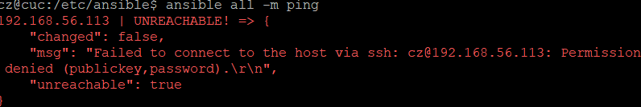  

  - 定义ansible_user ， 在host目标主机后面追加  `ansible_user=root`

    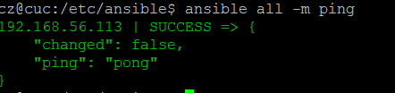  

- 启动install.sh  
  - 报错，应该是第一次授权的问题，重试一次不再出现这个问题

    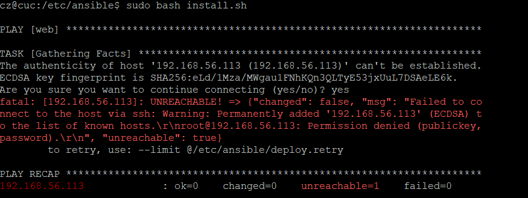

  - 再次启动，samba服务器部署报错  


    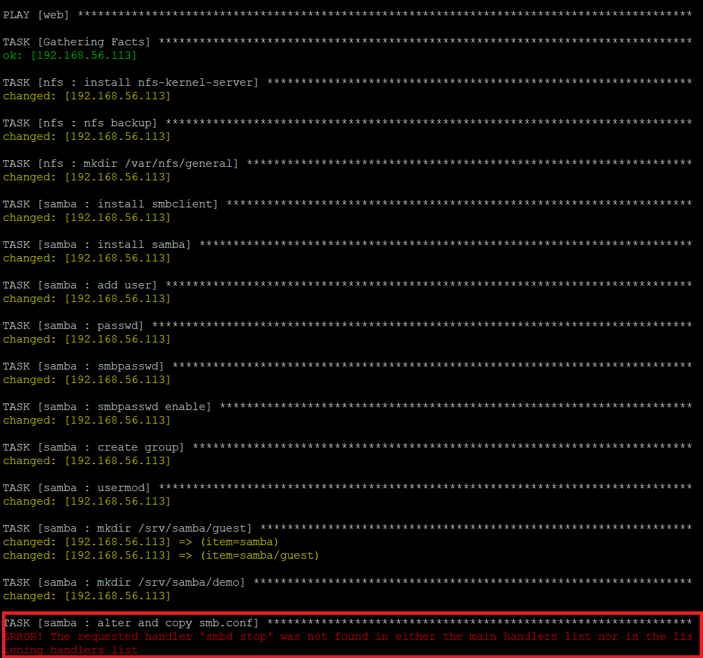

  - 在samble的/roles/samba/handlers/main.yml中定义  
    ```bash
    - name: stop smbd
    service: name=smbd state=stop
    ```

  - 重新启动install.sh，在RUNNING HANDLER[dhcp ...]处报错

    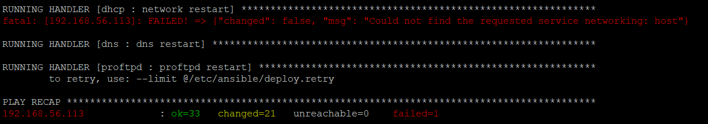
  - 原因是ubuntu18.04 网络配置服务应该systemd-networkd.service而不是networking.service,修改dhcp的main.yml

    ```bash
    - name: network restart
    service: name=systemd-networkd state=restarted
    ```
 - 继续重新尝试部署(ansible幂等性的性质，多次部署不影响结果)


    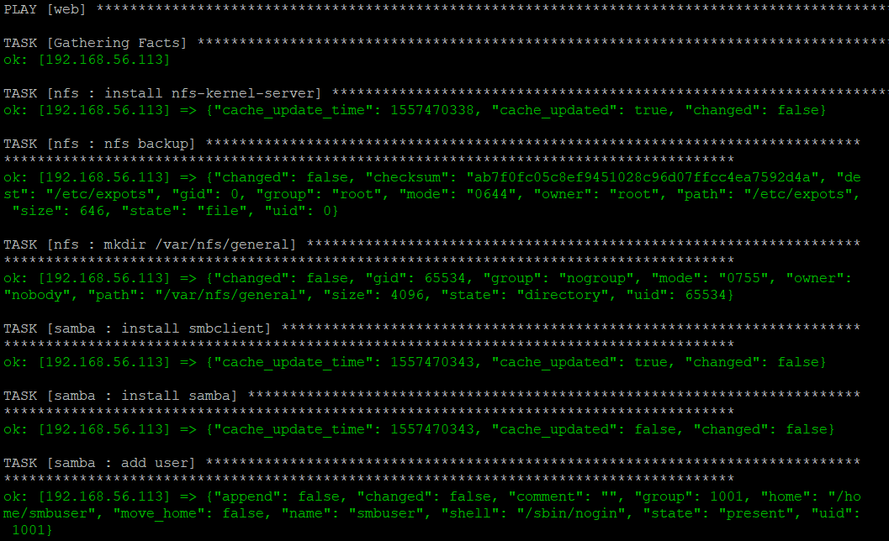
    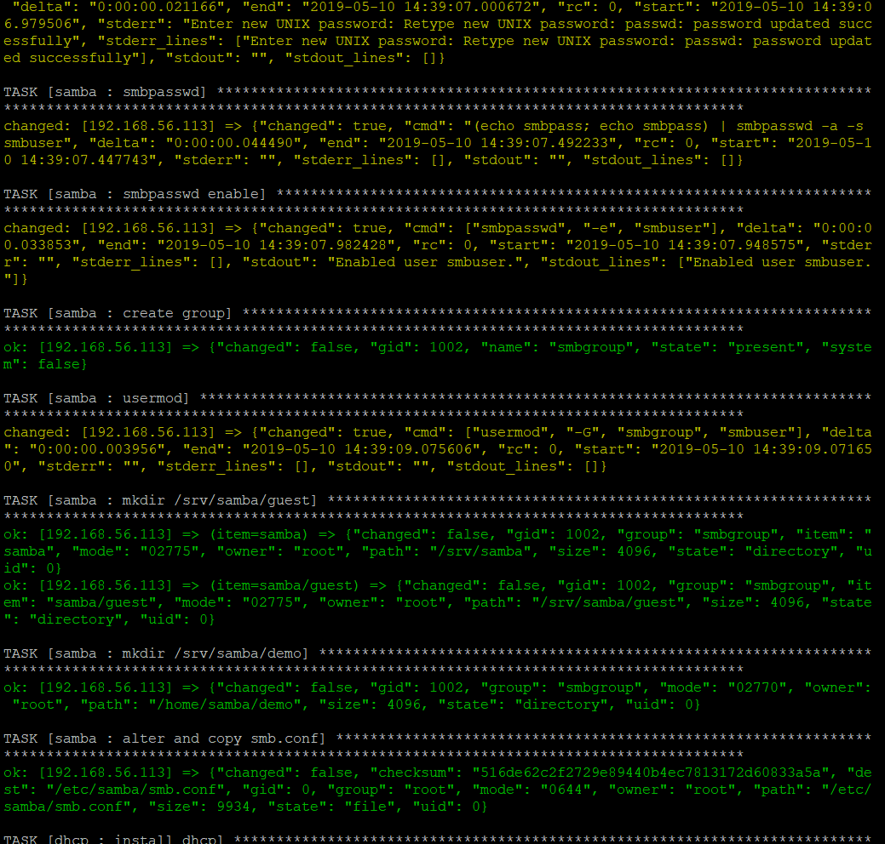
    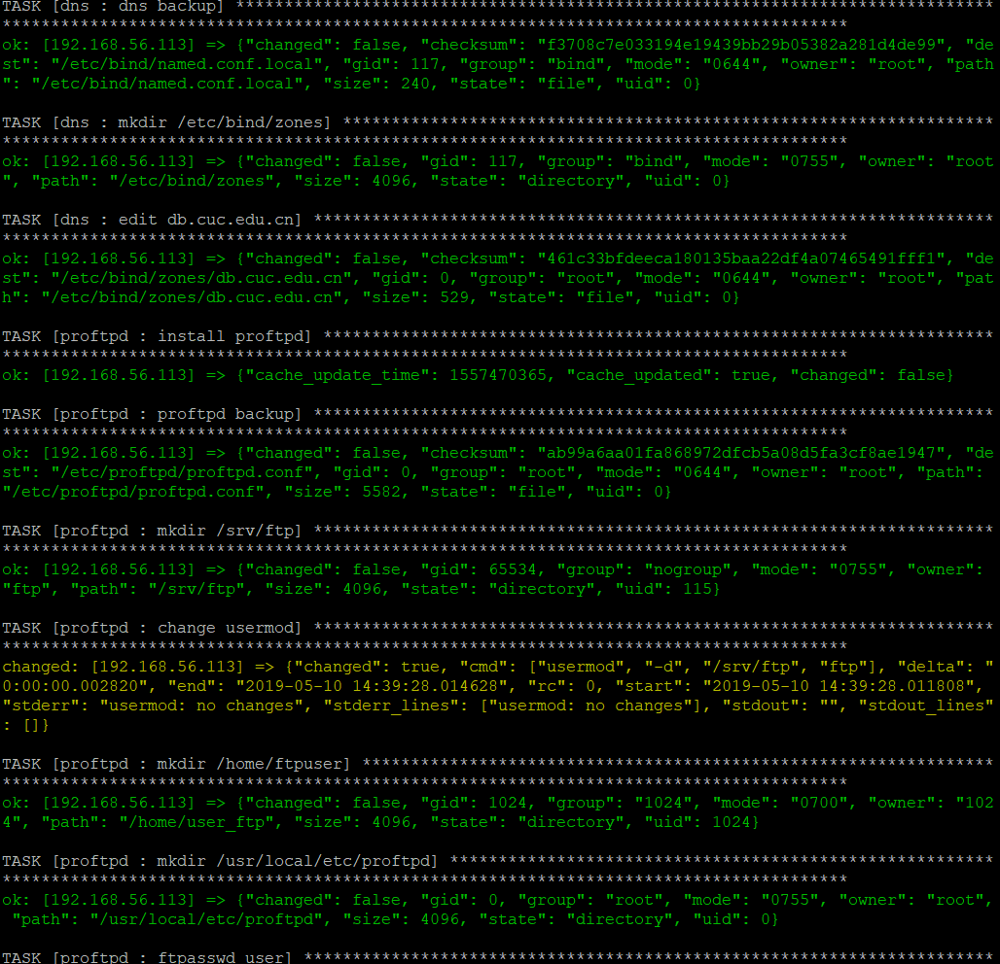
    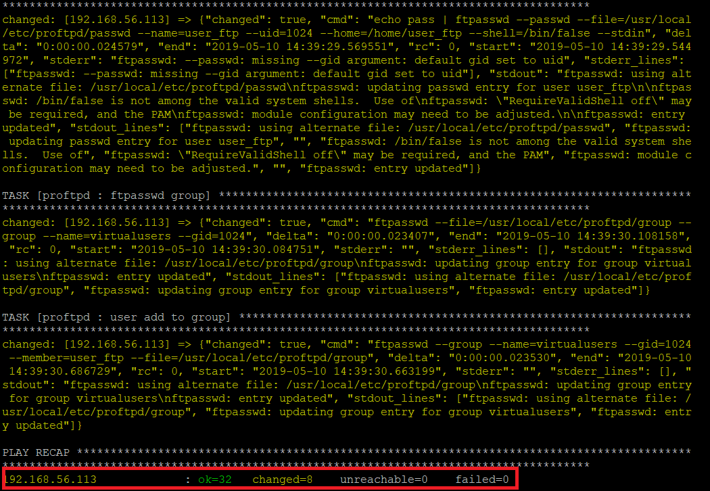

## 参考文档
- [ansible 课件](http://sec.cuc.edu.cn/huangwei/course/LinuxSysAdmin/chap0x08.md.html#/title-slide)
- [ansible tutorial](https://serversforhackers.com/c/an-ansible-tutorial) 
- [往期师哥师姐实验参考](https://github.com/CUCCS/2015-linux-public-tyushua1/tree/%E5%AE%9E%E9%AA%8C%E4%B8%83)
- [往期师哥师姐实验参考](https://github.com/CUCCS/2015-linux-public-songyawen/tree/master/exp7)