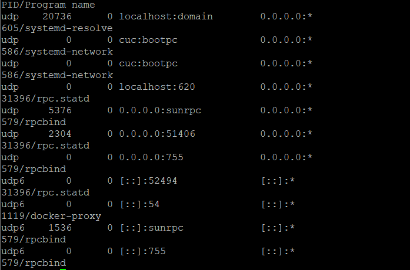

# 实验八 使用容器技术重构FTP、NFS、DHCP、DNS、Samba服务器的自动安装与自动配置
## 实验环境
- ubuntu 18.04
- docker 18.09.5


## 实验要求
 - [x] DHCP
 - [x] DNS
 - [ ] NFS
 - [x] FTP
 - [x] Samba

注：本次实验是5个部分分别进行搭建的,由于时间和能力有限，所以该实验做得比较简单。

## DNS
- 下载image

- 启动  

```bash
docker run \
    --name dnsmasq \
    -d \
    -p 53:53/udp \
    -p 5380:8080 \
    -v /opt/dnsmasq.conf:/etc/dnsmasq.conf \
    --log-opt "max-size=100m" \
    -e "HTTP_USER=foo" \
    -e "HTTP_PASS=bar" \
    --restart always \
    jpillora/dnsmasq
```


- 验证  


---

## DHCP
- 下载image  
`docker pull networkboot/dhcpd`

- 配置dhcp.conf(具体配置见dhcp.conf文件)

- 启动

```bash
docker run -it --rm --init --net host -v "$(pwd)/data":/data networkboot/dhcpd enp0s8
```

- 验证
  - 启动之前  




  - 启动之后  


## FTP
- 下载image

    `docker pull stilliard/pure-ftpd:hardened`
- 启动
```bash
docker run -d --name ftpd_server -p 21:21 -p 30000-30009:30000-30009 -e "PUBLICHOST=localhost" stilliard/pure-ftpd:hardened
```
- 验证  

    `ftp -p localhost 21`  


- 尝试编写docker-compose.yml来构建

  - docker-compose.yml
    ```bash
    version: '2'
    services:
    ftpd_server:
        image: stilliard/pure-ftpd
        container_name: pure-ftpd
        ports:
        - "21:21"
        - "30000-30009:30000-30009"
        environment:
        PUBLICHOST: "localhost"
        FTP_USER_NAME: bob
        FTP_USER_PASS: mypass
        FTP_USER_HOME: /home/bob
        volumes:
        - "/home/andrew/tmp/dpftpd/usr/data:/home/bob/"
        - "/home/andrew/tmp/dpftpd/usr/passwd:/etc/pure-ftpd/passwd"
    ```
  - 构建并运行可以得到同样效果 
    `docker-compose up --build`  
    `ftp -p localhost 21`


## NFS
- 这里做的是nfs-client，nfs-server是本机安装的
- 下载image  
    `docker pull outstand/nfs-client`

- 启动

    ```bash
    docker run -itd \
        --name nfs-vols \
        --restart=always \
        --privileged=true \
        --net=host \
        -v /:/mnt \
        -e SERVER=192.168.56.102 \
        -e SHARE=movies \
        -e MOUNT_OPTIONS="nfsvers=3,ro" \
        -e FSTYPE=nfs3 \
        -e MOUNTPOINT=/mnt \
        outstand/nfs-client
    ```
- 验证    


## Samba

- 下载image
- 启动

    ```bash
    sudo docker run -it -p 139:139 -p 445:445 -d dperson/samba \
        -u "cz;badpass" \
        -s "public;/home/cz/share/" \
        -s "users;/home/cz/u_share/;yes;yes;yes;cz" \
        -s "cz private share;/home/cz/p_share/;yes;yes;yes;cz"

    ```
- 验证  
  - 在宿主机中使用win+R //192.168.56.102
  - 结果  
    


## 参考资料
- [docker hub](https://hub.docker.com/)
- [阮一峰 docker入门](http://www.ruanyifeng.com/blog/2018/02/docker-tutorial.html)
- [docker doc](https://docs.docker.com/engine/docker-overview/)
- [A Docker Tutorial for Beginners](https://docker-curriculum.com/)
